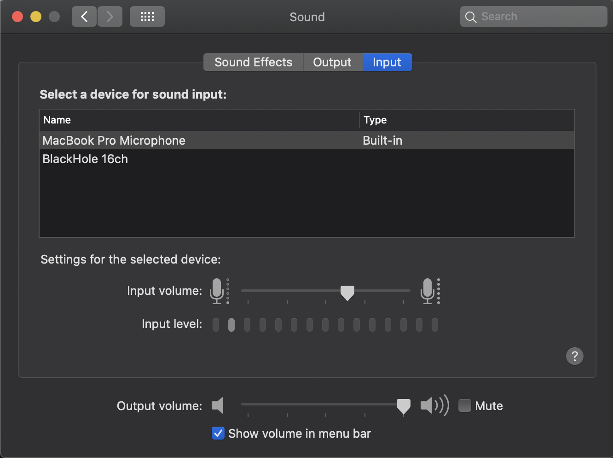

# Loudred - Discord Bot for streaming audio


_A wild Loudred appeared_

> Loudred! Loudred!

Hmm... this Loudred appears to be trying to say something.

> Loudred LOUDRED Loudred!

It seems like they're saying...that they're a Discord Audio Bot that streams audio from a MacOS audio device?

## Motivations

This is quite strange. Wild Loudred don't usually venture out this way. Why are you here, Loudred?

> Loudred Loud!

They're saying that they're here to fix a limitation with [Go Live with Discord](https://support.discord.com/hc/en-us/articles/360040816151-Share-your-screen-with-Go-Live-Screen-Share) on MacOS. Currently, MacOS users are unable to stream audio through this service, but by adding Loudred as a bot, you can stream audio through them instead.

## Setup

> Loud Loud Loudred!

Slow down there, Loudred! They appear to be trying to tell us how to use them to stream audio. It seems a little complicated, but I'll do my best to break it down:

### 1. Setup a Discord Bot and add it to your Server

The first thing you need to do is create an application with a bot, and then add it to your server.

> Loudred!

Oh, thank you Loudred! They've given us some helpful documentation

- [Read this to learn how to set up a Discord Bot and application](https://discordjs.guide/preparations/setting-up-a-bot-application.html)
- and [read this to learn how to add your bot to a server](https://discordjs.guide/preparations/adding-your-bot-to-servers.html)

At the end of this process, your bot page should look something like this:


_NOTE: Feel free to name your bot and application something other than Loudred!_

### 2. Configure your audio devices

For this next step, you'll need some way of capturing your computer's sound output in an audio device

> Loud! Loud!

Loudred recommends using a program called [BlackHole](https://github.com/ExistentialAudio/BlackHole) (a wonderful program that you should consider [sponsoring](https://github.com/sponsors/ExistentialAudio)) for this. It works by creating a virtual audio device that you can read and write audio data to. Don't worry if you don't understand all that, we'll walk you through how to set all this up later! You can install it with homebrew by running the command:

```bash
brew cask install blackhole
```

[Or install it using their intaller](http://existential.audio/blackhole/)

Check out your audio devices by going to `System Preferences > Sound`. You should have the following output devices:


and the following input devices:



### 3. Download this Github repository

> Loudred! Loudred! LOUDRED!

For the next step, you'll need to make sure you have the following installed:

1. NodeJS - [Download NodeJS here](https://nodejs.org/en/download/)
2. FFmpeg - [Download FFmpeg here](https://ffmpeg.org/download.html) or install it using `brew install ffmpeg`

Once you have those installed, clone this repo using the following command:

```bash
git clone https://github.com/reccanti/Loudred.git && cd Loudred
```

Then install the npm packages using

```bash
npm install
```

### 4. Setup Audio Sources

If the program you're trying to stream supports changing the Audio output device, that's great! Just set that to BlackHole and Loudred will start streaming it to Discord.

A great example of this is VLC

However, not all programs support this, so in that case you need to
